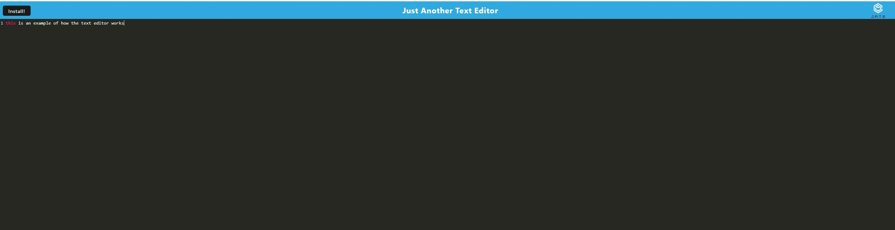

# text-editor

# Table of Contents
- [Description](#description)
- [Installation](#installation)
- [Usage](#usage)
- [Credits](#credits)
- [Tests](#tests)
- [License](#license)
- [Questions](#questions)

## license 
    
  
This application is licensed by MIT

## Description

This app is a text editor that allows you to write text and download the website.

## Installation

Install the app from Github then run npm i in the terminal

## Usage

Type in the black space on the website then click install to download your text to save it.

(https://nameless-crag-03888-1abe8b1701fc.herokuapp.com/)

## Credits

Grant Creach

## Tests 

No, no special tests required

## Questions 

If you have any questions, reach out to me using the following:

Email: gcreach97@gmail.com
GitHub: Gcreach